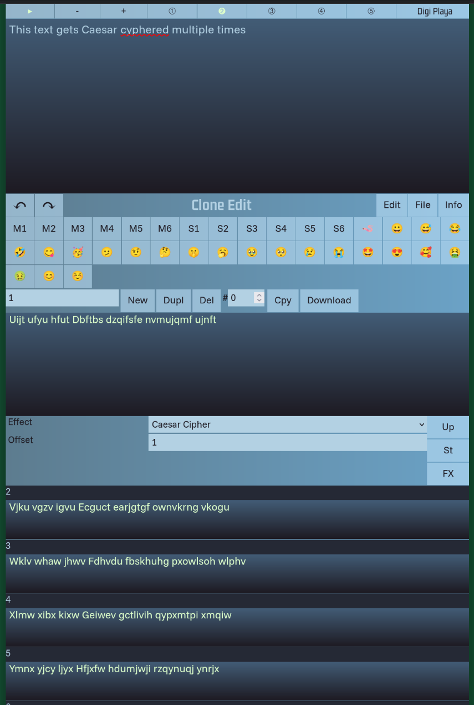

# Clone Edit
Use the text force Luke !

> How can I have a template for social media ?

> How can I have instant translation for the text I type ?

> How can I post on several social media without multi-copy/paste ?

> How can I store multiple values and define a set of special characters of my liking ?

The readme -files represent days of development . Checkout with day1 - day9
From then on each development step has a branch name of vX with X starting from v10
The size of the branch can take several days and should contain significant visible changes as a user would like it when communicated / but few enough to not overwhelm appropriate to the project size

Early development Pre-alpha

User Documentation built-in and updated from time to time

Screenshot

