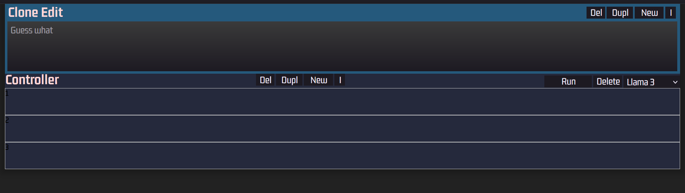

# Clone Edit Tag 2

- model.ts erweitern
- Erste hartkodierte Filter
- Refactoring mit UI Anpassung
- Context mit LocalStorage kopiert von dc3



app.tsx delegiert nur
```
return (
		<>
			<Editor appState={state} />
			<Clones appState={state} />
		</>
	)
```

Aber es kommt gleich noch ein Kontext dazu . Kann ich auch nicht auswendig . Einfach runterkopieren und dann ist schon klar wie das funktioniert . Ein Kontext ist wie die Logikzentrale einer übergeordneten Einheit / wir haben nur eine
```
return (
		<CloneEditContextProvider initialState={state}>
			<Editor appState={state} />
			<Clones appState={state} />
		</CloneEditContextProvider>
	)
```

Alle React Elemente innerhalb des Kontextes haben zugriff auf die daraus bereitgestellten Eigenschaften und Methoden