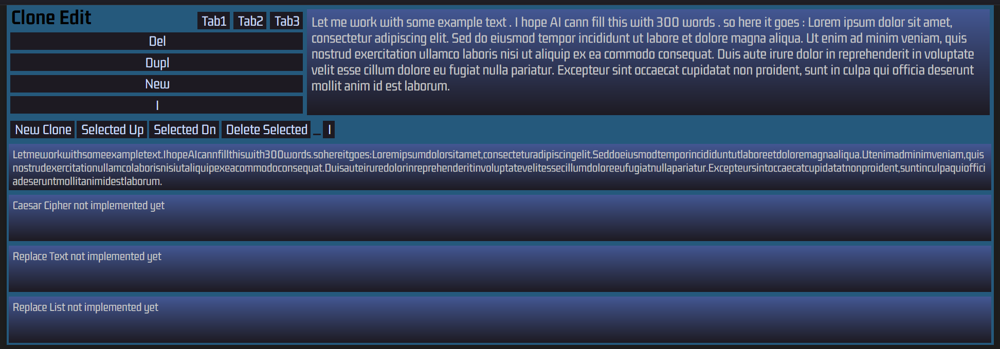

# Clone Edit Tag 2

- model.ts erweitern
- Erste hartkodierte Filter
- Refactoring mit UI Anpassung
- Context mit LocalStorage kopiert von dc3
- Weitere UI - Anpassungen und Entwurf möglicher Funktionen


app.tsx delegiert nur
```
// app.tsx
return (
		<>
			<Editor appState={state} />
			<Clones appState={state} />
		</>
	)
```

Aber es kommt gleich noch ein Kontext dazu . Kann ich auch nicht auswendig . Einfach runterkopieren und dann ist schon klar wie das funktioniert . Ein Kontext ist wie die Logikzentrale einer übergeordneten Einheit / wir haben nur eine
```
// app.tsx
return (
		<CloneEditContextProvider initialState={state}>
			<Editor appState={state} />
			<Clones appState={state} />
		</CloneEditContextProvider>
	)
```

Alle React Elemente innerhalb des Kontextes haben Zugriff auf die daraus bereitgestellten Eigenschaften und Methoden

Was gäbe es da ? Das Model sagt zB es gibt Settings wie eine globale Schriftart . Komponenten müssen über eine Änderung dises States informiert bleiben . Bei einem Kontext wird der Objektbaum nicht eingeimpft sondern man holt ihn sich bei Bedarf :

```
// editor.tsx
const { state } = useCloneEditContext()
```
Hier haben wir definiert dass es state im CloneEditContextProvider gibt :
```
context.tsx
return (
		<CloneEditContext.Provider value={{ state: state }}>
			{children}
		</CloneEditContext.Provider>
	)
```
Es spricht nichts dagegen dass auch kleine Komponenten vollen Zugriff auf den State - Tree haben denn es ist eine Referenz auf ein einziges Originalobjekt - *eine* " Source of Truth " . Die Regel ist jedoch dass keine Komponente den State selbstständig ändern darf sondern Änderungen nur an den Context meldet der dann entscheidet was mit dieser Meldung zu tun ist
