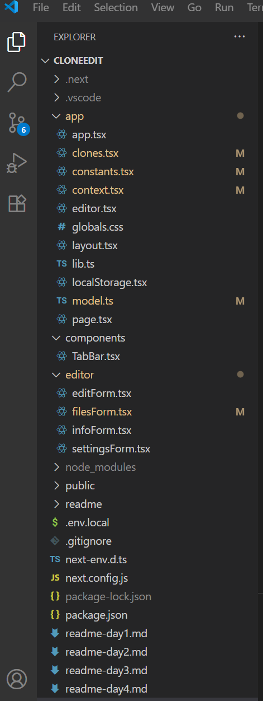
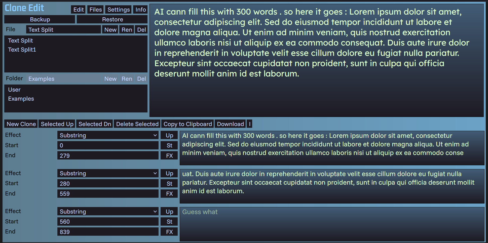

# Clone Edit Tag 5

- Refactorings
- Info Form mit Donate
- UI Anpassungen
- File / Folder switch erster Ansatz funktioniert
- Example mit funktionierenden Substring Filtern

Das Projekt sieht zu dem Zeitpunkt einigermaßen sauber aus :
- Kernkomponenten sind in /app
- /components bzw Wiederverwendbares gibt es noch nicht viel
- Untergeordnete Komponenten sind im gleichlautenden Verzeichnis zB editor/
- Es gibt ein einfaches App Model das auf den bisherigen use cases gut funktioniert
- Es gibt einen Kontext der zentral die Steuerung übernimmt

Nichts Besonderes eigentlich . Ein - würde ich sagen - Standard React auf Next Projektentwurf

Und ein verändertes UI

