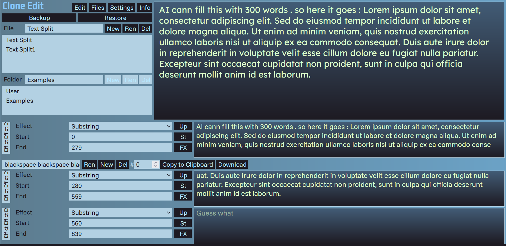
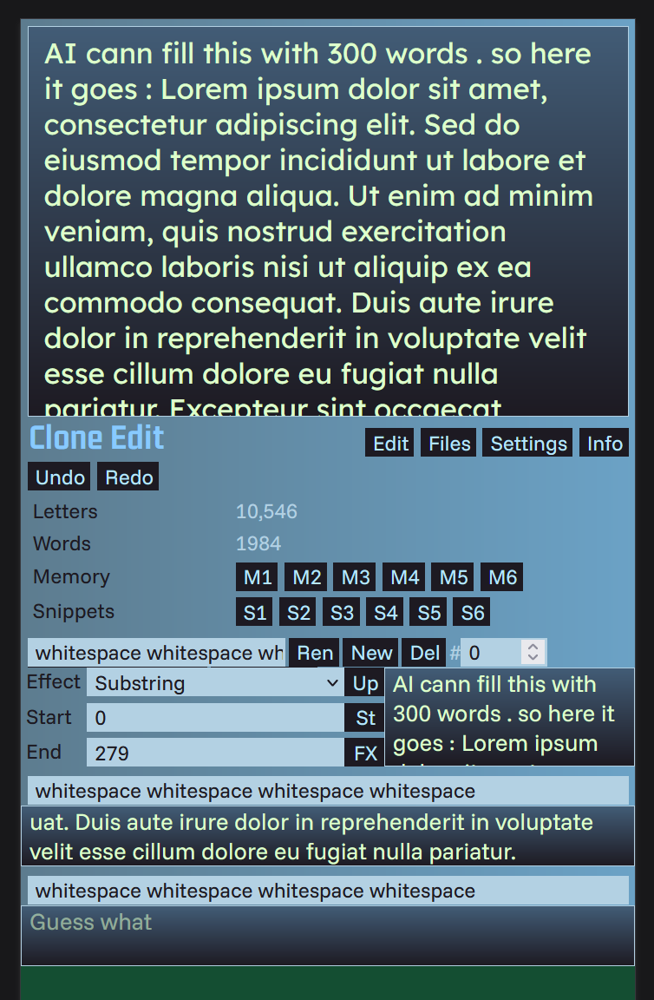

# Clone Edit Tag 6

- Clone selectability : Um Platz zu sparen wird der Clone Controller direkt über dem jeweilig ausgewählten Klon angezeigt
- Klone haben einen Namen um sich bei größeren Projekten besser zu orientieren
- Clone UI features approach
- select clone working : Die Anzahl der Klone könnte groß sein / da sollte das Kontextmenü immer oben vom Klon sein

- responsive : 

-> Smileys

-> example für bluesky und x

-> Klick auf Clone Edit schließt Menü