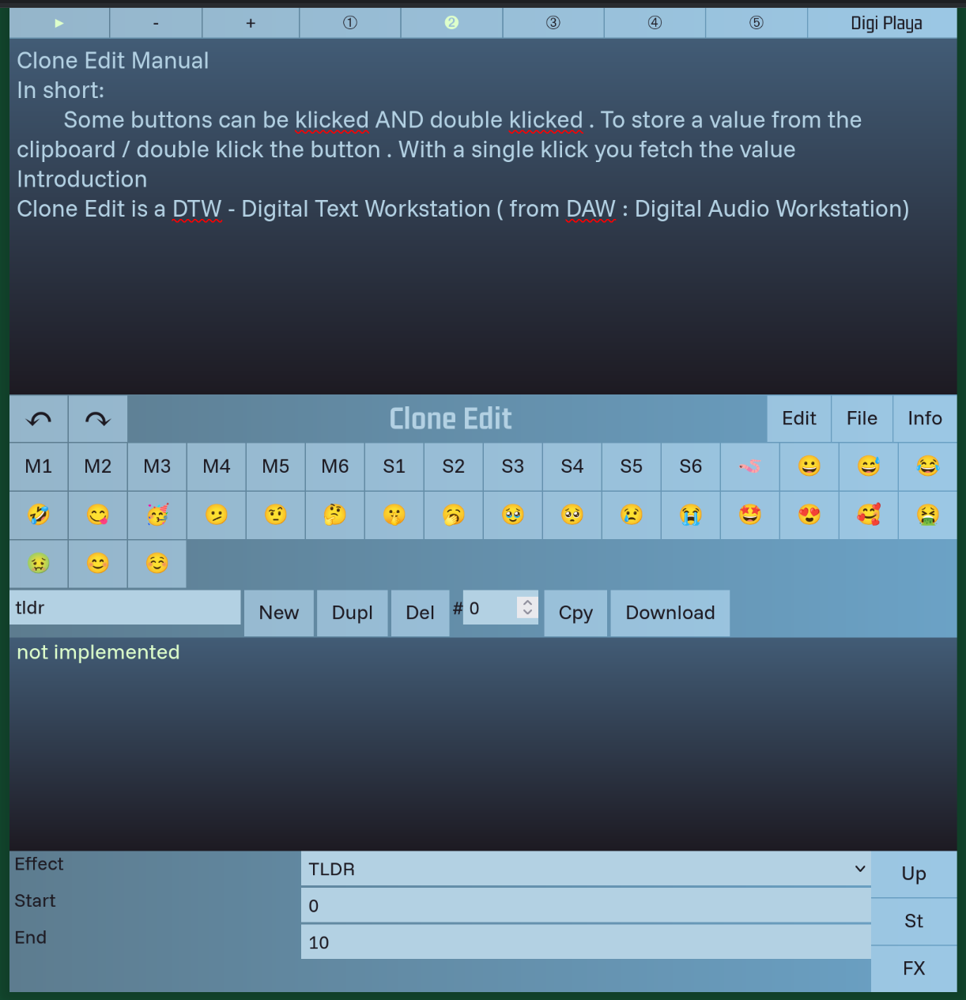

# Clone Edit Tag 9

- more responsive; minimum size: 330
- dazu edit form aufräumen

Switch von Branchnamen von dayX zu vX wobei X von 1 aufwärts zählt aber die Tage übernommen werden . Also kommt als nächstes v10 das die Versionsnummer 0.10 darstellt . Bei v100 springt es also auf Version 1.0 . Man kann das auch zu einem beliebigen Zeitpunkt vorziehen oder verlängern : dann macht man eben die Branches größer

Und da es letztens nichts gab mal ein Screenshot vom aktuellen Design

